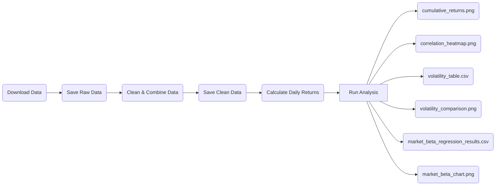

# Empirical-project

## Project question

How do equity (ETFs) sectors differ in returns, volatility, and sensitivity (β) to the overall market over the last 16 years?

## Project overview

In this project i will compare major equity sectors using daily market data and ETFs. It examines sector performance (return), volatility, correlation, and market sensitivity using Python analysis.

## Repository structure

- data/raw contains original data
- data/clean contains cleaned datasets
- output contains figures and tables
- report contains the final blog as a Quarto file
- src means **source code** and contains the main Python scripts used in the project
- .gitignore tells git what files to ignore, like unnecessary mac files

## Replication

To reproduce this project, you have to run the script (src) in order from `src/01` to `src/05`

### Required Packages:

This Project uses exclusively Python and the following libraries:

- ***pandas***:
  - Used for cleaning, reading, and combining the data
- ***numpy***:
  - Used for numerical calculations
- ***matplotlib***:
  - Used for creating charts and figures for visualisation
- ***seaborn***:
  - Used for more visual outputs like the heat-map
- ***yfinance***:
  - Open source program used to download the financial data from Yahoo Finance
- ***statsmodels***:
  - Used for the stats model and the regression

You can install them with the following command line:\
`python3 -m pip install pandas numpy matplotlib seaborn yfinance statsmodels`

### Flowchart of actions

### Project Workflow

1.  `src/01_get_data.py`

This script is to download daily ETF as well as market (SPY) price data from Yahoo Finance using yfinance for the the last 10 years using an interval of 1 day

2.  `src/02_clean_data.py`

This script reads the raw data and cleans it by: - keeping required price columns - removes lines with missing data - sort the data by date and tickers - adds ticker & sector labels - saves data to `data/clean/sector_prices.csv`

3.  `src/03_daily_return_data.py`

Calculates daily percentage return for all tickers and every day for last 10 years using the cleaned data Saves the data to `data/clean/sector_daily_return.csv`

4.  `src/04_analysis.py`

Produces the descriptive outputs and visualsation used in the project: - summary statistics - cumulative return figure - volatility comparison - correlation heat-map These are saved in `output/tables` and `output/figures`

5.  `src/05_market_beta_regression.py`

Runs a market model regression for each sector ETF using SPY as the market benchmark It saves the regression results table and the market beta figure in `output/tables` and `output/figures`

### Run Order

To get the project replicated you have to run the script in this order:

`python3 src/01_get_data.py`\
`python3 src/02_clean_data.py`\
`python3 src/03_daily_return_data.py`\
`python3 src/04_analysis.py`\
`python3 src/05_market_beta_regression.py`

## Output

The final project outputs are stored in: 
- `output/figures` contains figures in .png format 
- `output/tables` contains tables in .csv format
- `report/blog.qmd` contains the final blogn in Quarto format

## Notes

#### Data Range

The data ranges over the last 16 years\
From 2010-01-01 to 2026-01-01\
This gives a wide range of historical data that provides a good  amount of data points for analysis, while also being recent enough.

#### Source of ETFs

- All ETFs come from [**State Street**](https://www.ssga.com/us/en/intermediary/capabilities/equities/sector-investing/sector-and-industry-etfs) to keep the sample consistent
- They are all American because the project uses SPY as a benchmark
- It keeps the analysis consistent as SPY is consistently used as a benchmark across different analysis

#### The tickers represent the following:

| Ticker | Full name & Link |
|------------|------------------------------------------------------------|
| SPY | [State Street® SPDR® S&P 500®](https://www.ssga.com/us/en/intermediary/etfs/state-street-spdr-sp-500-etf-trust-spy) |
| XLK | [State Street® Technology Select Sector](https://www.ssga.com/us/en/intermediary/etfs/state-street-technology-select-sector-spdr-etf-xlk) |
| XLF | [State Street® Financial Select Sector](https://www.ssga.com/us/en/intermediary/etfs/state-street-financial-select-sector-spdr-etf-xlf) |
| XLV | [State Street® Health Care Select Sector](https://www.ssga.com/us/en/intermediary/etfs/state-street-health-care-select-sector-spdr-etf-xlv) |
| XLE | [State Street® Energy Select Sector](https://www.ssga.com/us/en/intermediary/etfs/state-street-energy-select-sector-spdr-etf-xle) |
| XLY | [State Street® Consumer Discretionary Select Sector](https://www.ssga.com/us/en/intermediary/etfs/state-street-consumer-discretionary-select-sector-spdr-etf-xly) |
| XLU | [State Street® Utilities Select Sector](https://www.ssga.com/us/en/intermediary/etfs/state-street-utilities-select-sector-spdr-etf-xlu) |
| XLP | [State Street® Consumer Staples Select Sector](https://www.ssga.com/us/en/intermediary/etfs/state-street-consumer-staples-select-sector-spdr-etf-xlp) |
| XLB | [State Street® Materials Select Sector](https://www.ssga.com/us/en/intermediary/etfs/state-street-materials-select-sector-spdr-etf-xlb) |