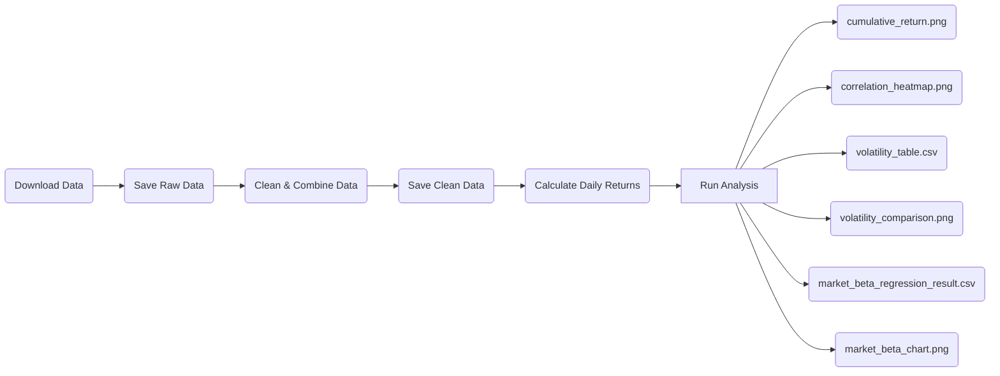

# Empirical-project

## Project question

How do equity (ETFs) sectors differ in returns, volatility, and sensitivity ((\beta\)) to the overall market?

## Project overview

In this project i will compare major equity sectors using daily market data and ETFs. It examines sector performance (return), volatility, correlation, and market sensitivity using Python analysis.

## Repository structure

data/raw contains original data\
data/clean contains cleaned datasets\
output contains figures and tables\
report contains the final blog or Quarto file src means **source code** and contains the main Python scripts used in the project .gitignore tells git what files to ignore, like uncessairy mac files

## Replication

To reproduce this project, you have to run the script (src) in order from 01 to 05

### Required Packages:

This Project uses exclusivley Python and the following libaries:

- pandas:
  - Used for cleaning, reading, and combining the data
  - I used them to wokr with the CSV files and caluclating returns
- numpy:
  - Used for nmumerical calculations
- matplotlib:
  - Used for creating charts and figures for visulaisation
- seaborn:
  - Used for more visual outputs like the heatmap
- yfinance:
  - Open source program that I used to download the financial data from Yahoo Finance
- statsmodels:
  - Used for the stats model and the regression

You can install them with the following command line: `python3 -m pip install pandas numpy matplotlib seaborn yfinance statsmodels`

### Flowchart of actions

### Project Workflow
1. `src/01_get_data.py`
  This script is to download daily ETF aswell as market (SPY) price data from Yahoo Finance using yfinance for the the last 10 years using an interval of 1 day

2. `src/02_clean_data.py`
  This script reads the raw data and cleans it by:
  - keeping required price columns
  - removes lines with missing data
  - sort the data by date and tickers
  - adds ticker & sector labels
  - saves data to `data/clean/sector_prices.csv`

3. `src/03_daily_return_data.py`
  Calculates daily percentage return for all tickers and every day for last 10 years using the cleaned data
  Saves the data to `data/clean/sector_daily_return.csv`

4. `src/04_analysis.py`
  Produces the descritpive outputs and visualsation used in the project:
  - summary statistics
  - cumulative return figure
  - volatility comparison
  - correlation heatmap
  These are saved in `output/tables` and `output/figures`

5. `src/05_market_beta_regression.py`
  Runs a market model regression for each sector ETF using SPY as the market benchmark
  It saves the regression results table and the market beta figure in `output/tables` and `output/figures`