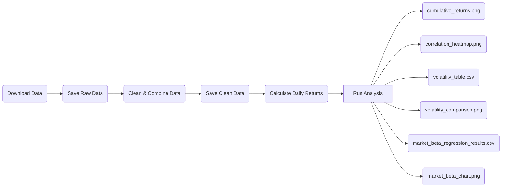

# Empirical-project: U.S. Equity Sector ETF Analysis

This repository contains my **BEE2041 Empirical Project**, which examines whether major U.S. equity sectors behaved differently over the period 2010 to 2025.


## Research question

How do major U.S. equity sectors (ETFs) differ over the sample period in terms of cumulative return, volatility, correlation, and sensitivity (β) to the overall market?

## Project Links

Live Blog:  [GitHub Pages site](https://kian-psr.github.io/Empirical-project)

Repository: [Empirical-project](https://github.com/kian-psr/Empirical-project)

## Project overview

In this project I will analyse daily adjusted price data for eight major SPDR sector ETFs and SPY in the time frame from the $1^{st}$ of January 2010 to the $31^{st}$ December 2025. The aim is to compare sector behaviour across four dimensions: 
1. **Long Run Returns**
2. **Volatility**
3. **Correlation**
4. **Market Beta**

The workflow begins by downloading raw ETF price data from Yahoo Finance. These files are then cleaned and combined, transformed into daily returns, and used to generate tables, figures, and regression outputs. The final product is a Quarto blog post published through GitHub Pages.

The cleaned datasets contain both a `Ticker` column and a `Sector` column. Ticker symbols are used for data matching, calculations, and regression logic, while sector names are used in the final tables, figures, and blog narrative to make the outputs easier to read.

The modelling component of the project is a market model regression for each sector ETF against the Market Benchmark.

## Repository structure
```text
Empirical-project
├── data
│   ├── raw    
│   └── clean
├── docs 
├── output
│   ├── figures    
│   └── tables  
├── src
│   ├── 01_get_data.py
│   ├── 02_clean_data.py
│   ├── 03_daily_return_data.py
│   ├── 04_analysis.py
|   └── 05_market_beta_regression.py
├── .gitignore
├── blog.qmd
├── README.md
└── run_all.py     
```

- `data/raw` contains original downloaded CSV files.
- `data/clean` contains cleaned and transformed datasets.
- `docs` contains the rendered website files used for GitHub Pages.
- `output` contains figures and tables.
- `src` contains all the scripts for the project 
- `.gitignore` tells git what files to ignore, like unnecessary mac files.
- `blog.qmd` contains the final blog as a Quarto file.
- `README.md` is this section
- `run_all.py` runs all scripts at once so it is easier to reproduce

## Data 

| Ticker | Description | Role |
|--------|-------------|------|
| SPY | [State Street® SPDR® S&P 500®](https://www.ssga.com/us/en/intermediary/etfs/state-street-spdr-sp-500-etf-trust-spy) | Market Benchmark |
| XLK | [State Street® Technology Select Sector](https://www.ssga.com/us/en/intermediary/etfs/state-street-technology-select-sector-spdr-etf-xlk) | Sector ETF |
| XLF | [State Street® Financial Select Sector](https://www.ssga.com/us/en/intermediary/etfs/state-street-financial-select-sector-spdr-etf-xlf) |Sector ETF |
| XLV | [State Street® Health Care Select Sector](https://www.ssga.com/us/en/intermediary/etfs/state-street-health-care-select-sector-spdr-etf-xlv) |Sector ETF |
| XLE | [State Street® Energy Select Sector](https://www.ssga.com/us/en/intermediary/etfs/state-street-energy-select-sector-spdr-etf-xle) |Sector ETF |
| XLY | [State Street® Consumer Discretionary Select Sector ](https://www.ssga.com/us/en/intermediary/etfs/state-street-consumer-discretionary-select-sector-spdr-etf-xly) |Sector ETF |
| XLU | [State Street® Utilities Select Sector](https://www.ssga.com/us/en/intermediary/etfs/state-street-utilities-select-sector-spdr-etf-xlu) |Sector ETF |
| XLP | [State Street® Consumer Staples Select Sector](https://www.ssga.com/us/en/intermediary/etfs/state-street-consumer-staples-select-sector-spdr-etf-xlp) |Sector ETF |
| XLB | [State Street® Materials Select Sector](https://www.ssga.com/us/en/intermediary/etfs/state-street-materials-select-sector-spdr-etf-xlb) |Sector ETF |

Source: **Yahoo Finance**, downloaded using `yfinance`.

Sample period: 2010-01-01 to 2025-12-31.


## Replication

To reproduce this project you will need:

- Python 3
- Quarto

And the following packages 
### Required Packages:

This Project uses exclusively Python and the following libraries:

- ***pandas***:
  - Used for cleaning, reading, and combining the data.
- ***numpy***:
  - Used for numerical calculations.
- ***matplotlib***:
  - Used for creating charts and figures for visualisation.
- ***yfinance***:
  - Open source program used to download the financial data from Yahoo Finance.
- ***statsmodels***:
  - Used for the stats model and the regression.

You can install them with the following command line:
``` bash
python3 -m pip install pandas numpy matplotlib yfinance statsmodels
```
### Flowchart of actions


```mermaid
flowchart LR
    A(Download Data) --> B(Save Raw Data)
    B --> C(Clean & Combine Data)
    C --> D(Save Clean Data)
    D --> E(Calculate Daily Returns)
    E --> F[Run Analysis]
    F --> G("cumulative_returns.png")
    F --> H("correlation_heatmap.png")
    F --> I("volatility_table.csv")
    F --> J("volatility_comparison.png")
    F --> K("market_beta_regression_results.csv")
    F --> L("market_beta_chart.png")
```

### Project Workflow

The script `run_all.py` is included to automate the full pipeline. It runs each source script in the correct order, from data download to final regression outputs.

1.  `src/01_get_data.py`

This script downloads daily ETF and benchmark price data from Yahoo Finance using `yfinance`.

2.  `src/02_clean_data.py`

This script reads the raw ETF data and cleans it by:

- keeping required price columns.
- removes lines with missing data. 
- sort the data by date and tickers.
- adds ticker & sector labels. 
- saves data to `data/clean/sector_prices.csv`.

3.  `src/03_daily_return_data.py`

This script calculates daily percentage returns for each ETF using the cleaned data. The output is saved to `data/clean/sector_daily_returns.csv`.

4.  `src/04_analysis.py`

Produces the descriptive outputs and visualsation used in the project:

- Summary statistics.
- Cumulative return figure.
- Volatility comparison.
- Correlation heat-map.
- These are saved in `output/tables` and `output/figures`.

5.  `src/05_market_beta_regression.py`

This script runs a market model regression for each sector ETF using SPY as the market benchmark. It saves the regression results table and the market beta figure in `output/tables` and `output/figures`.

### Run Order

The full data pipeline can be reproduced from the project root using:

`python3 run_all.py`

Alternatively, each script can be run manually in the following order:

```bash
python3 src/01_get_data.py
python3 src/02_clean_data.py
python3 src/03_daily_return_data.py
python3 src/04_analysis.py
python3 src/05_market_beta_regression.py
```

### Rebuild the website
After generating the outputs, render the Quarto blog with:

```bash
quarto render blog.qmd --to html --output index.html --output-dir docs
```

## Output

The project generates the following outputs.

### Figures
- `cumulative_returns.png`
- `cumulative_returns_covid.png`
- `volatility_comparison.png`
- `correlation_heatmap.png`
- `market_beta_chart.png`

### Tables
- `summary_statistics.csv`
- `volatility_table.csv`
- `correlation_matrix.csv`
- `market_beta_regression_results.csv`

The final written output is the Quarto blog post in `blog.qmd`, published online through GitHub Pages.

## Notes

### Methods Note

The analysis combines descriptive statistics with a simple market model regression:

$R_{t,i} = \alpha_i + \beta_i R_{SPY,t} + \varepsilon_{t,i}$

where $R_{t,i}$ is the daily return of sector $i$, and $R_{SPY,t}$ is the daily return of the Overall Market benchmark, represented by SPY. This allows the project to compare not only performance and volatility, but also each sector’s sensitivity to broader market movements.

### Source of ETFs

- All ETFs come from [**State Street SPDR Family**](https://www.ssga.com/us/en/intermediary/capabilities/equities/sector-investing/sector-and-industry-etfs) to keep the sample consistent
- They are all U.S. based because the project uses SPY as a benchmark
- It keeps the analysis consistent as SPY is consistently used as a benchmark across different analysis

### What each ETF represents

#### SPY:
SPY is the benchmark ETF in this project. It tracks the S&P 500, so it represents a broad basket of large cap U.S. companies across all eleven GICS sectors. In this analysis, it is used as a proxy for the overall U.S. equity market.

#### XLK, Technology:
XLK tracks the technology sector of the S&P 500. It includes large U.S. technology firms, such as companies involved in software, hardware, semiconductors, IT services, and related technology activities.

#### XLF, Financials:
XLF tracks the financial sector of the S&P 500. It includes companies in financial services, insurance, banks, capital markets, mortgage REITs, and consumer finance.

#### XLV, Health Care:
XLV tracks the health care sector of the S&P 500. It includes firms in pharmaceuticals, biotechnology, health care equipment and supplies, health care providers and services, life sciences tools, and health care technology.

#### XLE, Energy
XLE tracks the energy sector of the S&P 500. It includes companies involved in oil, gas and consumable fuels, as well as energy equipment and services.

#### XLY, Consumer Discretionary
XLY tracks the consumer discretionary sector of the S&P 500. It includes companies whose products and services are generally linked to non essential consumer spending, such as retail, hotels, restaurants, leisure, apparel, automobiles, and household durables.

#### XLU, Utilities:
XLU tracks the utilities sector of the S&P 500. It includes companies involved in electric utilities, water utilities, gas utilities, multi utilities, and independent power and renewable electricity production.

#### XLP, Consumer Staples:
XLP tracks the consumer staples sector of the S&P 500. It includes companies that produce or sell essential everyday goods, such as food, beverages, household products, tobacco, personal care products, and staples retail.

#### XLB, Materials:
XLB tracks the materials sector of the S&P 500. It includes firms in chemicals, metals and mining, paper and forest products, containers and packaging, and construction materials.

***Using SPY alongside Select Sector SPDR ETFs allows the project to compare sector specific behaviour against a consistent broad market benchmark***