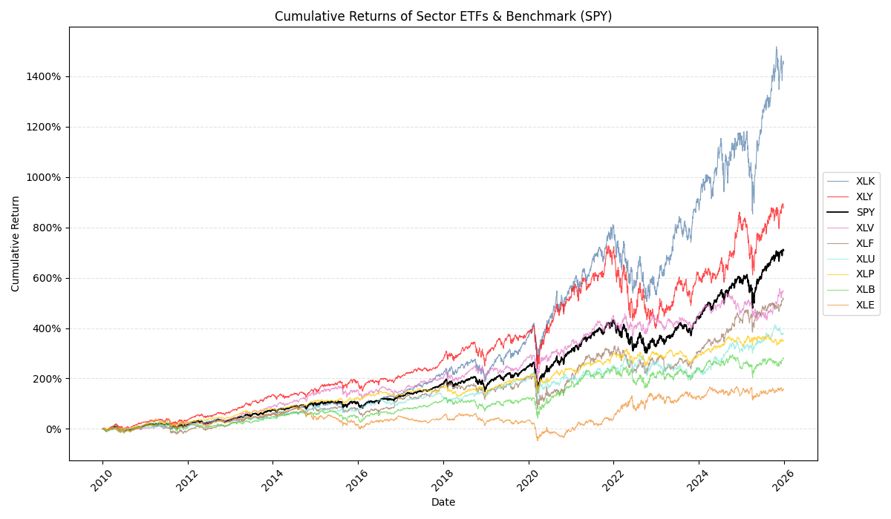
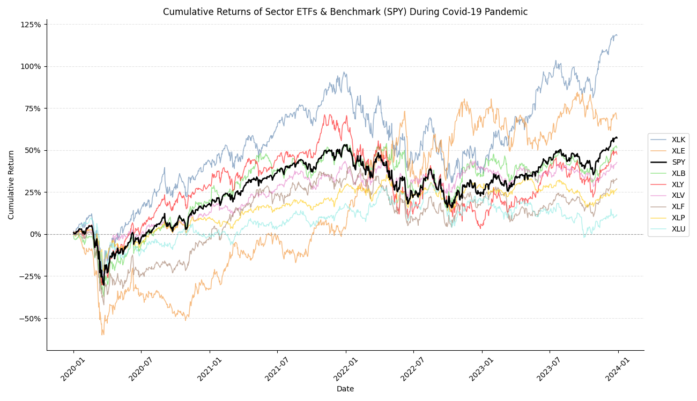

# Which U.S. Equity Sectors Really Behaved Differently in the Last Decade and a Half? 

Word count: xxxx words

## Introduction

Investors often talk about equity sectors as if their differences are obvious and predictable. Technology is often associated with rapid growth, utilities with stability, and energy with strong cycles. But investing in equity sectors is about more than just identifying which sector has the best return. Considering factors like how volatile sectors are, how they move with each other, and how sensitive they are to movements in the market is equally, if not more important\.

This blog examines whether major U.S. equity sectors really behaved differently over time. Using daily ETF data from 1st of January 2010, to 31st of December 2025, I will look at four main dimensions: long-run returns, volatility, correlation, and market beta. The goal is to understand if any sectors offered any meaningfully different investment profiles over the period, and to see what the trends have been.

## Data
The analysis uses daily adjusted price data for 8 major sector ETFs, as well as for SPY, the benchmark of this analysis. The sample covers a range of 15 years, giving a long time frame that includes both stable periods and some more volatile periods like the covid 19 pandemic. To keep the comparison consistent, all the ETFs are sourced from the [**State Street SPDR Family**](https://www.ssga.com/us/en/intermediary/capabilities/equities/sector-investing/sector-and-industry-etfs). Therefore, each ETF represents a specific part of the U.S. equity market within the same general fund structure.\

Daily adjusted prices are converted into returns and then used to compare sectors across the four dimensions mentioned. This allows the analysis to go beyond simple return comparisons and examine whether sectors offered meaningfully different investment profiles over time.\

**The following table gives an overview of what each ticker stands for:**

| Ticker |Sector or Benchmark      | Role in the analysis |
|--------|-------------------------|----------------------|
| SPY    | S&P 500 ETF             | Benchmark            |
| XLK    | Technology              | Sector ETF           |
| XLF    | Financial               | Sector ETF           |
| XLV    | Health Care             | Sector ETF           |
| XLE    | Energy                  | Sector ETF           |
| XLY    | Consumer Discretionary  | Sector ETF           |
| XLU    | Utilities               | Sector ETF           |
| XLP    | Consumer Staples        | Sector ETF           |
| XLB    | Materials               | Sector ETF           |

## Workflow and Methodology

The project follows a clear and replicable workflow. Daily price data for SPY and the sector ETFs were first collected and stored as separate raw CSV files. These raw files were then cleaned, combined, and transformed into daily returns, which form the basis of the analysis.\

Using these returns, the project generates summary statistics and visual outputs to compare sectors across performance, volatility, and correlation. To extend the analysis beyond descriptive comparisons, I also estimated sector betas relative to SPY as the market benchmark. This creates a transparent workflow that goes from raw data to cleaned data, descriptive evidence, and regression-based measures of market exposure. 

## Results and interpretation

### Long-run returns

A natural way to start the comparison of these sectors is to compare their performance over the period. Cumulative returns show how performance evolved over the last 15 years and the percentage increase since the start. This makes it easy to identify sectors with strong long-run results and how even or uneven their performance was. 

The figure shows that sector performance differed substantially over time. Technology (XLK) was by far the strongest performer, ending the sample with cumulative returns of more than 1400% and finishing well above all other sectors. Consumer Discretionary (XLY) also performed strongly and outpaced the broader market for most of the period, ending at roughly 900%. SPY, which serves as the benchmark, also delivered strong long-run growth, but remained clearly below the two best-performing sectors. By contrast, Energy (XLE) was the weakest performer. Its returns were much lower than the rest of the sample, only ending with a 190% cumulative return over 15 years, and it was notably more fragile, with a prolonged period of weakness between 2015 and 2020, even going negative briefly.\

The differences in behaviour became more visible after 2020 and COVID-19. To analyse this further, the next figure focuses on the Covid period and the aftermath

## Conclusion
This section will summarise the main findings and discuss the limits of the analysis.