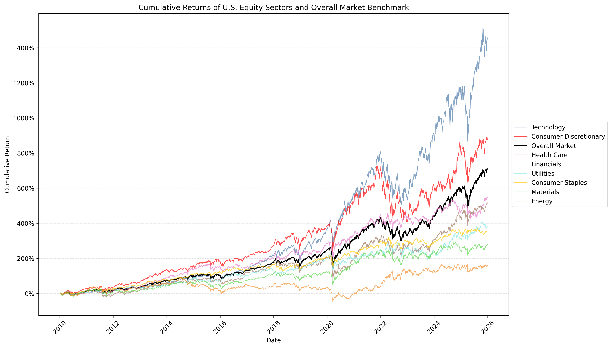
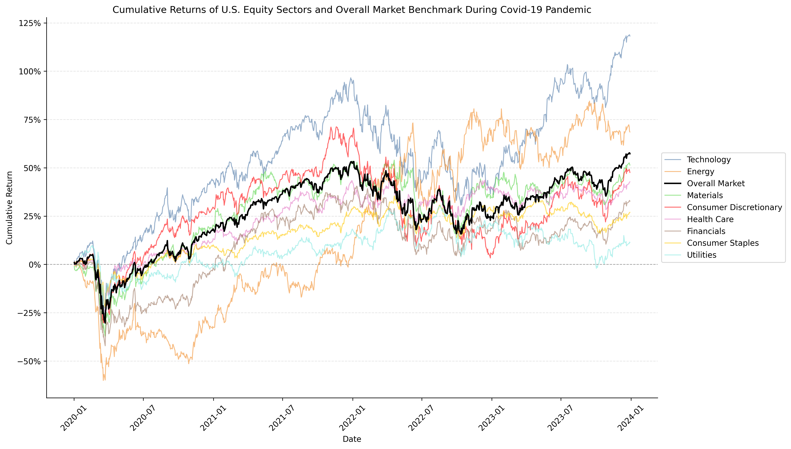
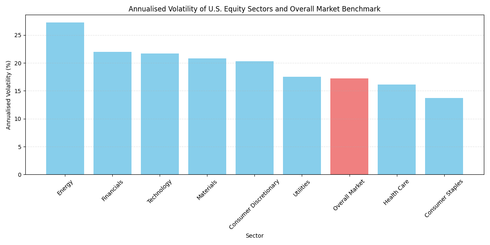
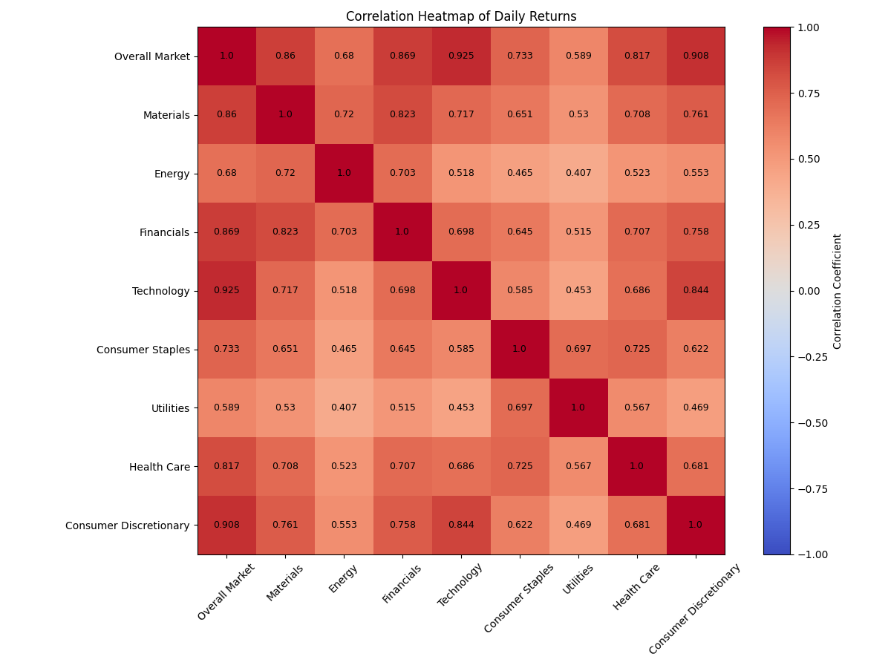
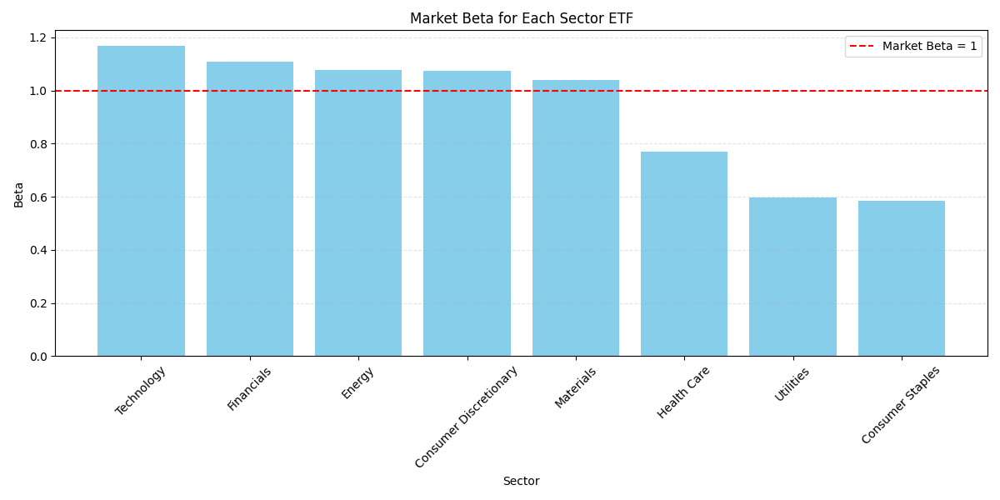

# Which U.S. Equity Sectors Really Behaved Differently in the Last Decade and a Half?

Word count: 2492 words

## Introduction

Investors often talk about equity sectors as if their differences are obvious and predictable. Technology is often associated with rapid growth, utilities with stability, and energy with strong cycles. But investing in equity sectors is about more than just identifying which sector has the best return. Considering factors like sector volatility, how sectors move with each other, and how sensitive they are to market movements is equally, if not more, important.

This blog examines whether major U.S. equity sectors really behaved differently over time. Using daily ETF data, we will look at four main dimensions: long-run returns, volatility, correlation, and market beta. The goal is to understand if any sectors offered any meaningfully different investment profiles over the period, and to see what the trends have been.

## Data

The analysis uses daily adjusted price data for 8 major sector ETFs and the SPY, the benchmark of this analysis. The sample covers the period from the $1^{st}$ of January 2010 to the $31^{st}$ of December 2025, providing a long time frame that includes both stable and more volatile periods, such as the COVID-19 pandemic. To keep the comparison consistent, all the ETFs are sourced from the [**State Street SPDR Family**](https://www.ssga.com/us/en/intermediary/capabilities/equities/sector-investing/sector-and-industry-etfs). Therefore, each ETF represents a specific part of the U.S. equity market within the same general fund structure.

Daily adjusted prices are converted into returns and then used to compare sectors across the four dimensions mentioned. This allows the analysis to go beyond simple return comparisons and examine whether sectors offered meaningfully different investment profiles over time.

**The following table gives an overview of what each ticker stands for:**

| Ticker | Sector or Benchmark    | Role in the analysis |
|--------|------------------------|----------------------|
| SPY    | S&P 500 ETF            | Benchmark            |
| XLK    | Technology             | Sector ETF           |
| XLF    | Financials             | Sector ETF           |
| XLV    | Health Care            | Sector ETF           |
| XLE    | Energy                 | Sector ETF           |
| XLY    | Consumer Discretionary | Sector ETF           |
| XLU    | Utilities              | Sector ETF           |
| XLP    | Consumer Staples       | Sector ETF           |
| XLB    | Materials              | Sector ETF           |

Each ticker is the market symbol for an ETF. SPY is included as the benchmark because it tracks the broader U.S. stock market, while the remaining tickers represent major sector ETFs from the same SPDR family, allowing for a more consistent comparison across sectors.

## Workflow and Methodology

The project follows a clear and replicable workflow. . Daily data for the SPY and the sector ETFs were first collected and stored as separate raw CSV files. These raw files were then cleaned, combined, and transformed into daily returns, which form the basis of the analysis.\

Using these returns, the project generates summary statistics and visual outputs to compare sectors across performance, volatility, and correlation. To extend the analysis beyond descriptive comparisons, I also estimated sector betas relative to SPY. This creates a transparent workflow that goes from raw data to cleaned data and to relevant visual and statistical outputs.

## Results and interpretation

### Long-run returns

A natural way to start the comparison of these sectors is to compare their performance over the period. Cumulative returns show how performance evolved over the full 2010 to 2025 period and the percentage increase since the start. This makes it easy to identify sectors with strong long-run results and how even or uneven their performance was.

{width="100%"}

The figure shows that sector performance differed substantially over time. Technology (XLK) was by far the strongest performer, ending the sample with cumulative returns of more than 1400% and finishing well above all other sectors. Consumer Discretionary (XLY) also performed strongly and outpaced the broader market for most of the period, ending at roughly 900%. The market benchmark, represented by SPY also delivered strong long-run growth, but remained clearly below the two best-performing sectors. By contrast, Energy (XLE) was the weakest performer. Its returns were much lower than the rest of the sample, only ending with a 190% cumulative return over the period, and it was notably more fragile, with a prolonged period of weakness between 2015 and 2020, even going negative briefly.

The differences in behavior became more visible after 2020 and COVID-19. To analyse this further, the next figure focuses on the COVID period and the aftermath

{width="100%"}

One important note is that the cumulative return series here begins in 2020. This means the chart should be read as performance relative to the start of the pandemic period, rather than over the full sample.

This closer view amplifies the differences that are already visible in the full view. While all sectors suffered from the initial pandemic shock, the scale of decline and the speed of the recovery varied largely. Energy (XLE) experienced the sharpest fall and remained with negative returns for much longer than the rest, it only moved back into positive cumulative return around the beginning of 2022. On the other side, Technology (XLK) recovered much quicker and only had a small drop after the shock. Post-COVID, it produced the strongest performance. Consumer Discretionary (XLY) also rebounded strongly and remained one of the better-performing sectors throughout the recovery. One of the most interesting patterns I discovered is that, despite suffering the deepest early losses, Energy eventually finished the period with the second-highest cumulative return. Utilities (XLU), in contrast, stayed one of the weakest sectors throughout. It followed a much flatter recovery path and ended the period well below the stronger growth sectors as well as the benchmark.

Although cumulative return is a useful comparison, it does not show the full picture. It doesn’t show how much risk investors faced along the way, which is why the next section turns to volatility.

### Volatility

To understand sector differences more fully, it is useful to compare return and volatility together.

#### Summary Statistic Table

```{python}
#| echo: false

import pandas as pd

df = pd.read_csv("output/tables/summary_statistics.csv") 
styled = (df.style
  .hide(axis="index")
  .format({
    "Mean Daily Return (%)": "{:.3f}",
    "Volatility (Std Dev)": "{:.3f}",
    "Worst Daily Return (%)": "{:.3f}",
    "Best Daily Return (%)": "{:.3f}",
    "Total Observations": "{:.0f}"  
  })
)
styled
```

The summary statistics table shows obvious differences in return, measured here as mean daily return (%) and volatility, as standard deviation. Technology (XLK) has the highest mean daily return at 0.078%, and close second is Consumer Discretionary (XLY) at 0.065%. We identified this trend above as well when we looked at cumulative returns. At the same time, both sectors were relatively volatile, with XLK at 1.369 and XLY at 1.281. In simple terms, a standard deviation of 1.369 suggests that XLK’s daily return was typically about 1.4 percentage points away from its average daily return, indicating a less stable return pattern. Energy (XLE) stands out the most as it has the worst mean daily return at 0.035%, combined with the highest volatility reported at 1.718 and also the worst single day loss at an impressive -20.141%. This makes Energy the weakest sector in terms of long-run growth and return to risk. By contrast, Consumer Staples (XLP) and Health Care (XLV) show much lower volatility, although this came with more modest average returns. This suggests that these sectors may have offered more stable, but less rewarding, investment profiles over the period.

#### Volatility Comparison

{width="100%"}

Annualised volatility shows how much a sector’s returns typically fluctuate over a year, so a higher value indicates a less stable return pattern. This graph makes the differences in risk even clearer. Energy (XLE) had the highest annualised volatility of more than 27%, which confirms that the ETF was less stable than the others. Financials (XLF) and Technology (XLK) also had somewhat higher volatility, however this came with a stronger return. The Overall Market benchmark (SPY) had an annualised volatility of around 17%, which places it near the middle of the distribution. This suggests that the broader market offered a more balanced risk profile than the most aggressive sector ETFs, while still being less defensive than sectors such as Health Care (XLV) and Consumer Staples (XLP). XLV had an annualised volatility of 16.2%, while XLP had 13.7%. A likely reason why XLP and XLV recorded the lowest volatility is that both are commonly considered defensive sectors, with demand that is less sensitive to changes in the wider economic cycle; people will always need essential consumer goods and health-related services in any economic period. An interesting point to note is that XLV has the second-lowest annualised volatility and standard deviation, yet it finished third highest out of the ETFs in terms of cumulative return.

Return and volatility show that sectors offered different risk-return profiles, but it does not show how they moved together. This is where correlation comes in.

### Correlation and Diversification

Correlation is a useful indicator to look at because it measures how much returns move together between sectors. A higher correlation means two sectors tend to rise and fall in similar ways, a lower correlation suggests that their returns are more distinct and don’t move with each other. This may offer more diversification benefits. 

{width="100%"}

The heatmap shows that all sectors were positively correlated with each other, meaning the sector ETFs moved together. The strongest correlations are between the market benchmark (SPY) and Technology (XLK), at 0.925, and between SPY and Consumer Discretionary (XLY) at 0.908. This high correlation means that Consumer Discretionary and Technology moved nearly identically to the market benchmark. This is likely because XLK and XLY make up 35% and 10%, respectively, of the SPY sector allocation. By contrast, Energy (XLE) and Utilities (XLU) recorded the lowest correlation at 0.407, suggesting that they behaved more differently from one another than any other pair of sectors in the sample. Energy and Utilities tend to show weaker correlations with the rest of the market, which gives some opportunity for diversification. However, because all correlations remained positive and many were still relatively high, the evidence suggests that sector diversification reduced risk only to a limited extent rather than creating fully independent return patterns.

Correlation tells us how closely sectors moved together, but it does not show how strongly each one responded to broader market swings, which is why the next section focuses on market beta.

### Market beta and market exposure

Market beta measures how sensitive a sector’s returns are to movements in the broader market. A beta above 1 suggests that a sector tends to move more than the market, while a beta below 1 indicates a less sensitive or more defensive return pattern. 

{width="100%"}

The chart confirms several patterns seen above. Technology (XLK) once again stands out, with a beta of 1.168, making it the most sensitive to movements in the overall market. Financials (XLF) ranks second with a beta of 1.108, which is interesting because its cumulative return was much less exceptional than that of XLK or XLY. This suggests that high market sensitivity does not automatically translate into the strongest long-run performance. Energy (XLE), Consumer Discretionary (XLY), and Materials (XLB) also recorded beta values above 1, indicating that these sectors tended to amplify market movements. By comparison, Health Care (XLV), Utilities (XLU), and Consumer Staples (XLP) all had beta values below 1, which supports the earlier view that these sectors behaved more defensively over the sample period. Consumer Staples (XLP) had the lowest beta at 0.584, implying that it was the least exposed to market-wide swings. Overall, the bar chart shows that the sector differences weren’t just about return and volatility, but also about how strongly each sector responded to changes in the market.

This chart gave us a good visual comparison of the beta values, but it does not show the full regression results, which is why I also present the regression table below.

#### Regression results
```{python}
#| echo: false
import pandas as pd

df = pd.read_csv("output/tables/market_beta_regression_results.csv")

df = df.rename(columns=
    {"alpha": "Alpha",
    "beta": "Beta",
    "r_squared": "R²",
    "p_value_alpha": "p-value-alpha",
    "p_value_beta": "p-value-beta",
    "observations": "Observations"
})
df = df.sort_values("Beta", ascending=False)

styled = (
    df.style
    .hide(axis="index")
    .format({
        "Alpha": "{:.3f}",
        "Beta": "{:.3f}",
        "R²": "{:.3f}",
        "p-value-alpha": "{:.3f}",
        "p-value-beta": "{:.3g}",
        "Observations": "{:.0f}"
    })
)
styled
``` 

While we already discussed the meaning of beta across the ETFs, it’s also important to understand the full regression and its values shown in the table above. Put simply, this regression creates a formula that uses SPY's daily return to predict each sector ETF's daily return, which helps show how sensitive each sector was to broader market movements. The estimated relationship can be written as:
$$
R_{t,i} = \alpha_i + \beta_i R_{SPY,t} + \varepsilon_{t,i}
$$
where $R_{t,i}$ is the daily return of sector ETF $i$ on day $t$, $\alpha_i$ is the intercept, $\beta_i$ is the slope coefficient, $R_{SPY,t}$ is the daily return of SPY on day $t$, and $\varepsilon_{t,i}$ is the error term, it captures the part of the sector’s return that is not explained by the market benchmark.

In this table, Alpha shows the return that is not explained by the market when SPY’s return is zero, Beta shows how strongly the ETF moved relative to the market, $R^2$ shows how much of the ETF’s return variation was explained by SPY, and the p-values test whether the estimated alpha and beta coefficients are statistically significant. The regression also includes an error term, $\varepsilon_{i,t}$. It does not appear in the results table because it is not a single estimated coefficient, but rather a separate residual for each observation in the sample.

The table gives us 2 more important insights beyond the beta chart. First, all beta coefficients are statistically significant. The beta p-values are extremely small and round to 0.000 in the table, meaning there is strong evidence of a relationship between each sector ETF and the market benchmark SPY. Second, the $R^2$ values differ quite a bit across the sectors. Technology (XLK) and Consumer Discretionary (XLY) have the highest $R^2$ values, at 0.855 and 0.824, which suggests that a large share of their daily return variation was explained by movements in SPY. This is a trend we have seen repeatedly now. Similarly, Utilities (XLU) and Energy (XLE) have much lower $R^2$ values, at 0.346 and 0.463, indicating that their returns were less closely tied to the market and more influenced by sector-specific factors. The alpha estimates are all quite small, and none are statistically significant, since the p-values for alpha remain far higher than normal significance levels. One partial exception is Materials (XLB), where the alpha p-value is 0.081, which may be interpreted as weak evidence at the 10% significance level, but not strong enough to conclude clearly that the sector generated abnormal return beyond market exposure.

The beta chart and regression table reinforce the finding of this blog: U.S. equity sectors did behave differently, not only in their long-run returns and volatility, but also in how closely they were tied to movements in the wider market.


## Conclusion

Overall, the evidence suggests that major U.S. equity sectors did behave differently over the tested period, but not in a way that makes one sector the clear best choice across all factors. Technology (XLK) delivered the strongest long-run performance, and Consumer Discretionary (XLY) substantially outperformed the market as well. This did, however, come with higher volatility, e.g. more risk than the Benchmark (SPY). On the more negative side, there was also a clear standout; Energy (XLE) had the weakest cumulative return, finishing far below the benchmark while also showing the highest volatility, making it the least stable investment profile. Health Care (XLV) and Consumer Staples (XLP), on the other hand, appeared more defensive, with much lower volatility and more stable return patterns.\

The correlation analysis adds an important point. Although the ETFs differed heavily in return and risk, all of them still moved positively with one another. This raises an important question: how much diversification benefit did the selected sector ETFs actually provide? The correlation results suggest that sector diversification offered some benefit, but not full independence. All sector ETFs remained positively correlated, so diversification reduced exposure to sector-specific movements only to a limited extent.

To conclude, the results show that sector investing is not simply a question of choosing the highest return. Different sectors offered different combinations of growth, stability, and market exposure, meaning that the most attractive choice depended on what an investor valued most. For investors seeking stronger growth, Technology and Consumer Discretionary stood out most clearly. For those placing greater weight on stability, Health Care and Consumer Staples appeared more attractive. The broader conclusion is therefore that U.S. equity sectors did behave meaningfully differently, but those differences are best understood as trade-offs rather than as a single clear ranking.